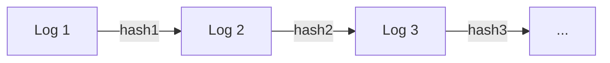

# Audit Log Integrity

<br>

## 📖 개요

금융 시스템에서 감사 로그(Audit Log)는 보안 사고 추적 및 규정 준수의 핵심 요소입니다. <br>
이 프로젝트는 블록체인의 체이닝 기술을 로깅 시스템에 적용하여, 로그의 **위변조, 삭제, 순서 변경을 원천적으로 탐지**할 수 있는 메커니즘을 제공합니다.

### 🛡️ 탐지 가능한 위협
- **내용 위변조:** 로그 메시지의 단 1바이트라도 변경되면 탐지
- **로그 삭제/삽입:** 중간 로그가 사라지거나 끼어들면 체인 붕괴
- **순서 변경:** 로그의 시간적 순서가 뒤바뀌면 탐지
- **타임스탬프 조작:** 시간 역행 탐지

<br>

## 🚀 사용 방법 (Usage)

### 1. 설정 (Configuration)
`src/main/resources/audit.properties` 파일에 비밀키와 초기 시드값을 설정합니다.
```properties
audit.secret.key=change-this-to-your-secure-secret-key
audit.initial.seed=INIT_SEED_0000

```

### 2. 로그 기록 (Logging)

로그를 남기면, `IntegrityAuditAppender`가 자동으로 해시 체인을 생성하여 기록합니다.

```java
private static final Logger logger = LoggerFactory.getLogger(MyClass.class);

public void processTransaction() {
    logger.info("사용자 로그인: user_id=1234");
    logger.info("계좌 이체 요청: amount=100,000");
    logger.info("트랜잭션 완료");
}

```

### 3. 무결성 검증 (Verification)

`LogVerifier`를 실행하여 저장된 로그 파일의 무결성을 검사합니다.

```java
LogVerifier verifier = new LogVerifier();
LogVerifier.VerifyResult result = verifier.verify(Paths.get("audit.log"));

if (result.valid) {
    System.out.println("✅ 검증 성공: " + result.verifiedLines + "개 로그 무결성 확인");
} else {
    System.err.println("🚨 위변조 감지!");
    System.err.println("위치: Line " + result.tamperedLine);
    System.err.println("원인: " + result.reason);
}

```

<br>

## 📄 로그 포맷 (Log Format)

실제 `audit.log` 파일에는 다음과 같은 `|` 구분자 형식으로 저장됩니다.

```text
timestamp | message | currentHash | previousHash

```

**실제 저장 예시:**

```text
1707112345001 | 사용자 로그인 | a8f5c...9e1 | INIT_SEED_0000
1707112345050 | 계좌 이체 요청 | b7d2a...1f4 | a8f5c...9e1
1707112345100 | 트랜잭션 완료 | c9e1b...3a2 | b7d2a...1f4

```

> 각 로그의 `currentHash`가 다음 로그의 `previousHash`로 연결되는 것을 볼 수 있습니다.

<br>

## 💡 핵심 원리 (Core Principles)

### 해시 체인 (Hash Chain)

블록체인과 유사하게, 각 로그 엔트리가 이전 로그의 해시값(Signature)을 포함하여 거대한 사슬을 형성합니다.



**해시 생성 공식:**
```CurrentHash = HMAC(Message + PreviousHash, SecretKey)```

중간에 로그가 하나라도 변경되면, 그 이후의 모든 해시 체인이 붕괴되어 즉각적인 탐지가 가능합니다.

<br>

## 🔍 검증 메커니즘 (Verification Mechanism)

검증기는 다음 3단계 검사를 순차적으로 수행합니다.

### 1. Timestamp 순서 검증 (시간적 무결성)

`Current.Timestamp >= Last.Timestamp` <br>
시간이 과거로 흐르는 비정상적인 타임스탬프 조작을 탐지합니다.

### 2. previousHash 체인 검증 (연결 무결성)

`Current.PreviousHash == Last.CurrentHash` <br>
로그의 삭제, 삽입, 순서 변경을 탐지합니다. 앞뒤 연결 고리가 끊어졌는지 확인합니다. 

### 3. currentHash 데이터 검증 (내용 무결성)

`Current.CurrentHash == HMAC(Message + PreviousHash, Key)` <br>
로그의 내용(메시지)이 변조되었는지 확인합니다. 비밀키가 없으면 유효한 해시를 만들 수 없습니다.

### 검증 흐름도

```text
       [ Log Entry N 읽기 ]
               │
               ▼
┌───────────────────────────────────┐
│ 1. Timestamp 순서 검증              │
│ (시간이 순차적으로 흐르는가?)            │
│ current.ts >= last.ts             │────(No)───▶ 🚫 FAIL: 시간 역행 감지
└──────────────┬────────────────────┘
               │ Yes
               ▼
┌───────────────────────────────────┐
│ 2. previousHash 체인 검증           │
│ (이전 로그와 연결이 맞는가?)            │
│ current.prev == last.curr         │────(No)───▶ 🚫 FAIL: 삭제/삽입/순서변경 감지
└──────────────┬────────────────────┘
               │ Yes
               ▼
┌───────────────────────────────────┐
│ 3. currentHash 무결성 검증           │
│ (내용이 변조되지 않았는가?)             │
│ current.curr == HMAC(...)         │────(No)───▶ 🚫 FAIL: 메시지 내용 위변조 감지
└──────────────┬────────────────────┘
               │ Yes
               ▼
       ✅ [OK] 다음 로그 검증

```

<br>

## 📊 검증 결과 예시

### 정상 (무결성 확인)

```
OK (verifiedLines=3)
```

### 위변조 탐지 시

**Case 1: 로그 삭제/순서 변경**

```
FAIL (verifiedLines=2, line=3,
      reason=previousHash 체인 불일치(삭제/삽입/순서 변경 의심),
      expected=abc123...,
      actual=xyz789...)
```

**Case 2: 로그 내용 조작**

```
FAIL (verifiedLines=1, line=2,
      reason=currentHash 불일치(내용 수정/위조 의심),
      expected=def456...,
      actual=ghi012...)
```

## 커스텀 포맷터 사용 가이드

`LogFormatter` 인터페이스를 구현하여 JSON, XML 등 원하는 포맷으로 로그를 저장할 수 있습니다.

### Use Case: JSON 포맷으로 로그 저장

**Step 1. LogFormatter 인터페이스 구현**

```java
package util;

import ch.qos.logback.classic.spi.ILoggingEvent;

public class JsonLogFormatter implements LogFormatter {

    @Override
    public String format(ILoggingEvent event, String currentHash, String previousHash) {
        return String.format(
            "{\"timestamp\":%d,\"message\":\"%s\",\"currentHash\":\"%s\",\"previousHash\":\"%s\"}",
            event.getTimeStamp(),
            escapeJson(event.getFormattedMessage()),
            currentHash,
            previousHash
        );
    }

    @Override
    public String[] parse(String rawLine) {
        // JSON 파싱 로직 구현
        // 반환: [timestamp, message, currentHash, previousHash]
    }

    private String escapeJson(String text) {
        return text.replace("\"", "\\\"");
    }
}
```

**Step 2. logback.xml 설정**

```xml
<?xml version="1.0" encoding="UTF-8"?>
<configuration>
    <appender name="AUDIT" class="core.IntegrityAuditAppender">
        <!-- 커스텀 포맷터 주입 -->
        <formatter class="util.JsonLogFormatter"/>
    </appender>

    <root level="INFO">
        <appender-ref ref="AUDIT" />
    </root>
</configuration>
```

**결과: audit.log**
```json
{"timestamp":1770172411905,"message":"관리자 로그인","currentHash":"vrKAx...","previousHash":"INIT_SEED_0000"}
{"timestamp":1770172411910,"message":"계좌 이체","currentHash":"xYz12...","previousHash":"vrKAx..."}
```

### 주의사항

| 항목 | 설명 |
|------|------|
| `format()` | 로그 기록 시 호출됨. 4개 필드(timestamp, message, currentHash, previousHash)를 포함해야 함 |
| `parse()` | 검증 시 호출됨. `String[4]` 형태로 `[timestamp, message, currentHash, previousHash]` 순서로 반환 |
| 검증기 연동 | 커스텀 포맷터 사용 시 `LogVerifier`도 해당 포맷터의 `parse()` 메서드를 사용하도록 수정 필요 |


