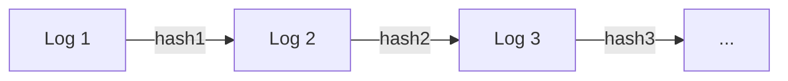

# Audit Log Integrity

<br>

## 📖 개요

금융 시스템에서 감사 로그(Audit Log)는 보안 사고 추적 및 규정 준수의 핵심 요소입니다. <br><br>
이 프로젝트는 로그의 **위변조, 삭제, 순서 변경을 원천적으로 탐지**할 수 있는 메커니즘을 제공합니다.

<br>

### 🛡️ 탐지 가능한 위협
- **내용 위변조:** 로그 메시지의 단 1바이트라도 변경되면 탐지
- **로그 삭제/삽입:** 중간 로그가 사라지거나 끼어들면 체인 붕괴
- **순서 변경:** 로그의 시간적 순서가 뒤바뀌면 탐지
- **타임스탬프 조작:** 시간 역행 탐지

<br>

## 🚀 사용 방법

### 1. 설정
`src/main/resources/audit.properties` 파일에 비밀키와 초기 시드값을 설정합니다.
```properties
audit.secret.key=top-secret
audit.initial.seed=INIT_SEED_V1
```

### 2. 로그 기록

로그를 남기면, `IntegrityAuditAppender`가 자동으로 해시 체인을 생성하여 기록합니다.

```java
// MDC 설정
MDC.put("userId", "admin001");
MDC.put("clientIp", "192.168.1.100");
        
// 로그인
.info("관리자 로그인");

// 조회
logger.info("계좌조회: 계좌번호=110-123-456");

// 이체
logger.info("계좌이체: 출금=110-123-456, 입금=220-456-789, 금액=1,000,000원");

// 로그아웃
logger.info("관리자 로그아웃");
```

``` java
// 접속시각 | userId | clientIP | 메시지(변경/조회 내용) | 현재 해쉬값 | 이전 해쉬값

2026-02-04 15:22:40 | admin001 | 192.168.1.100 | 관리자 로그인 | fa7TqwM9bS... | INIT_SEED_0000
2026-02-04 15:22:40 | admin001 | 192.168.1.100 | 계좌조회: 계좌번호=110-123-456 | 4QT+QxDJe8... | fa7TqwM9bS...
2026-02-04 15:22:40 | admin001 | 192.168.1.100 | 계좌이체: 출금=110-123-456, 입금=220-456-789, 금액=1,000,000원 | fTtpJ/p/K1... | 4QT+QxDJe8...
2026-02-04 15:22:40 | admin001 | 192.168.1.100 | 관리자 로그아웃 | LOJlM23cmX... | fTtpJ/p/K1...
```

### 3. 무결성 검증

`LogVerifier`를 실행하여 저장된 로그 파일의 무결성을 검사합니다.

```java
// 검증 성공 시
OK (verifiedLines=4)

// 위변조 감지 시
FAIL (verifiedLines=2, line=3, reason=currentHash 불일치(내용 수정/위조 의심), expected=expectedCurrentHash=vf9isrcipddZvQOe9uNB12XJOjVlFNn7DR291pkAa/g=, actual=actualCurrentHash=fTtpJ/p/K10ahFbpDJjB5RcffKJGsDu/+VQ92EVmCy0=, raw=2026-02-04 15:22:40 | admin001 | 192.168.1.100 | 계좌이체: 출금=110-123-456, 입금=220-456-7891, 금액=11,000,000원 | fTtpJ/p/K10ahFbpDJjB5RcffKJGsDu/+VQ92EVmCy0= | 4QT+QxDJe87WPIrR1J3ugvCeacV84c9ndf5zATxdn7M=)
---- 상세 ----
line    : 3
reason  : currentHash 불일치(내용 수정/위조 의심)
expected: expectedCurrentHash=vf9isrcipddZvQOe9uNB12XJOjVlFNn7DR291pkAa/g=
actual  : actualCurrentHash=fTtpJ/p/K10ahFbpDJjB5RcffKJGsDu/+VQ92EVmCy0=
rawLine : 2026-02-04 15:22:40 | admin001 | 192.168.1.100 | 계좌이체: 출금=110-123-456, 입금=220-456-7891, 금액=11,000,000원 | fTtpJ/p/K10ahFbpDJjB5RcffKJGsDu/+VQ92EVmCy0= | 4QT+QxDJe87WPIrR1J3ugvCeacV84c9ndf5zATxdn7M=

```

<br>

## 💡 핵심 원리

### 해시 체인 (Hash Chain)

각 로그 엔트리가 이전 로그의 해시값을 포함하여 거대한 사슬을 형성합니다.



**해시 생성 공식:**
```CurrentHash = HMAC(Message + PreviousHash, SecretKey)```

중간에 로그가 하나라도 변경되면, 그 이후의 모든 해시 체인이 붕괴되어 즉각적인 탐지가 가능합니다.

<br>

## 🔍 검증 메커니즘 (Verification Mechanism)

### 1. previousHash 체인 검증 (연결 무결성)

`Current.PreviousHash == Last.CurrentHash` <br>
- 로그의 삭제, 삽입, 순서 변경을 탐지합니다. 앞뒤 연결 고리가 끊어졌는지 확인합니다. 

### 2. currentHash 데이터 검증 (내용 무결성)

`Current.CurrentHash == HMAC(Message + PreviousHash, Key)` <br>
- 로그의 내용(메시지)이 변조되었는지 확인합니다. 비밀키가 없으면 유효한 해시를 만들 수 없습니다.

<br>


