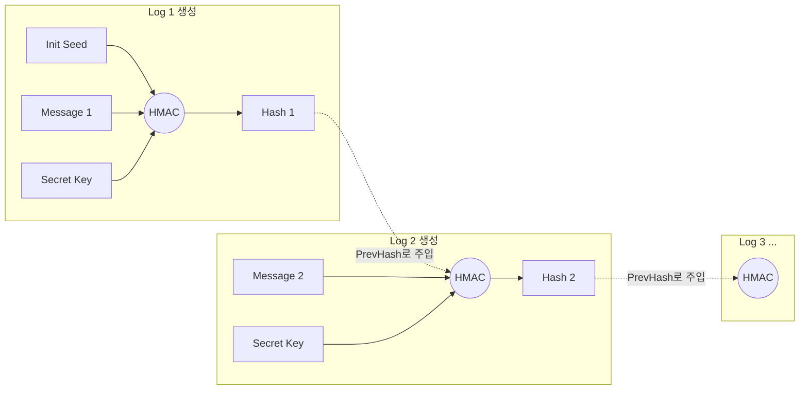

# 감사 로그 변조 방지 (Audit Log Integrity)

<br>

## 개요

금융 시스템에서 감사 로그(Audit Log)는 보안 사고 추적 및 규정 준수의 핵심 요소입니다.
이 프로젝트는 는 금융 거래, 시스템 접근 등 민감한 작업의 로그가 생성된 시점부터 보관되는 동안의 위조, 변조, 삭제, 혹은 순서 변경을 탐지하는 Java 라이브러리입니다.

#### 탐지 가능한 위협
 - **내용 위변조:** 로그 메시지의 단 1바이트라도 변경되면 탐지
 - **로그 삭제/삽입:** 중간 로그가 사라지거나 끼어들면 체인 붕괴
 - **순서 변경:** 로그의 시간적 순서가 뒤바뀌면 탐지

<br>

## System Architecture
1. **Core (Appender)**: Logback 환경에서 로그 이벤트를 가로채 해시를 생성하고 기록합니다.
2. **Util (Formatter & Hasher)**: 데이터 포맷팅과 암호화 연산을 수행합니다.
3. **Verifier**: 저장된 로그 파일을 전수 조사하여 무결성을 검증합니다.

<br>

## Getting Started

### 1. 설정
1. 빌드 후 라이브러리를 pom.xml에 추가합니다.
```xml
<dependency>
    <groupId>com.service.woori</groupId>
    <artifactId>audit-log</artifactId>
    <version>1.0.1</version>
</dependency>
```

2. `src/main/resources/audit.properties` 파일에 해시 생성에 사용할 비밀키를 설정합니다.
```properties
audit.secret.key=top-secret
```

3. Logback 설정 파일(`logback.xml`)에 `IntegrityAuditAppender`를 등록하고 사용할 `Formatter`를 주입합니다.
```xml
 <configuration>
    <appender name="AUDIT" class="core.IntegrityAuditAppender">
    
    	<!-- 로그 파일 이름, 경로 설정 -->
        <logFileName>audit.log</logFileName>
        
        <!-- 사용자 커스텀 formatter 설정 (비어있으면 default)-->
        <formatterClass></formatterClass>
        
        </appender>
    <root level="INFO">
        <appender-ref ref="AUDIT" />
    </root>
</configuration>
```

### 2. 로그 기록

로그를 남기면, `IntegrityAuditAppender`가 자동으로 해시 체인을 생성하여 기록합니다.

```java
// MDC 설정
MDC.put("userId", "admin001");
MDC.put("clientIp", "192.168.1.100");
        
// 로그인
logger.info("관리자 로그인");

// 조회
logger.info("계좌조회: 계좌번호=110-123-456");

// 이체
logger.info("계좌이체: 출금=110-123-456, 입금=220-456-789, 금액=1,000,000원");

// 로그아웃
logger.info("관리자 로그아웃");
```

```java
# audit.log
# 접속시각 | userId | clientIP | 메시지(변경/조회 내용) | 현재 해쉬값 | 이전 해쉬값

2026-02-04 15:22:40 | admin001 | 192.168.1.100 | 관리자 로그인 | fa7TqwM9bS... | INIT_SEED_0000
2026-02-04 15:22:40 | admin001 | 192.168.1.100 | 계좌조회: 계좌번호=110-123-456 | 4QT+QxDJe8... | fa7TqwM9bS...
2026-02-04 15:22:40 | admin001 | 192.168.1.100 | 계좌이체: 출금=110-123-456, 입금=220-456-789, 금액=1,000,000원 | fTtpJ/p/K1... | 4QT+QxDJe8...
2026-02-04 15:22:40 | admin001 | 192.168.1.100 | 관리자 로그아웃 | LOJlM23cmX... | fTtpJ/p/K1...
```

### 3. 무결성 검증

`LogVerifier`를 실행하여 저장된 로그 파일의 무결성을 검사합니다.

```java
Path auditLogPath = Paths.get("audit.log");

LogVerifier verifier = new LogVerifier(); // default formatter 사용
VerifyResult result = verifier.verify(auditLogPath);

System.out.println(result);
```

```java
// 검증 성공 시
OK (verifiedLines=4)

// 위변조 감지 시
FAIL (verifiedLines=2, line=3, reason=currentHash 불일치(내용 수정/위조 의심), expected=expectedCurrentHash=vf9isrcipddZvQOe9uNB12XJOjVlFNn7DR291pkAa/g=, actual=actualCurrentHash=fTtpJ/p/K10ahFbpDJjB5RcffKJGsDu/+VQ92EVmCy0=, raw=2026-02-04 15:22:40 | admin001 | 192.168.1.100 | 계좌이체: 출금=110-123-456, 입금=220-456-7891, 금액=11,000,000원 | fTtpJ/p/K10ahFbpDJjB5RcffKJGsDu/+VQ92EVmCy0= | 4QT+QxDJe87WPIrR1J3ugvCeacV84c9ndf5zATxdn7M=)
---- 상세 ----
line    : 3
reason  : currentHash 불일치(내용 수정/위조 의심)
expected: expectedCurrentHash=vf9isrcipddZvQOe9uNB12XJOjVlFNn7DR291pkAa/g=
actual  : actualCurrentHash=fTtpJ/p/K10ahFbpDJjB5RcffKJGsDu/+VQ92EVmCy0=
rawLine : 2026-02-04 15:22:40 | admin001 | 192.168.1.100 | 계좌이체: 출금=110-123-456, 입금=220-456-7891, 금액=11,000,000원 | fTtpJ/p/K10ahFbpDJjB5RcffKJGsDu/+VQ92EVmCy0= | 4QT+QxDJe87WPIrR1J3ugvCeacV84c9ndf5zATxdn7M=

```

<br>

## 핵심 원리

### 해시 체인

각 로그 엔트리가 이전 로그의 해시값을 포함하여 거대한 사슬을 형성합니다.



**해시 생성 공식:**
```CurrentHash = HMAC(Message + PreviousHash, SecretKey)```

중간에 로그가 하나라도 변경되면, 그 이후의 모든 해시 체인이 붕괴되어 즉각적인 탐지가 가능합니다.

<br>

## 검증 메커니즘

1. **HMAC 기반 단일 로그 무결성 (Integrity)**
* 로그 메시지와 이전 해시를 결합하여 실시간으로 HMAC을 계산합니다.
* 저장된 `currentHash`와 계산값이 다를 경우, 해당 로그 내용이 변조된 것으로 판단합니다.


2. **해시 체인 연결성 검증 (Chain Continuity)**
* 현재 로그의 `previousHash`가 직전 로그의 `currentHash`와 일치하는지 확인합니다.
* 체인 단절 시 로그의 **순서 변경, 중간 삭제, 임의 삽입** 공격을 탐지합니다.


3. **파일 끝 삭제 탐지 (Tail Truncation)**
* 별도의 관리 파일(`audit.head`)에 기록된 최신 해시와 실제 로그 파일의 마지막 해시를 비교합니다.
* 두 값이 다를 경우 최신 로그 삭제 및 롤백 시도가 있었음을 의미합니다.


4. **연쇄 오류 식별 및 추적 (Root Cause Analysis)**
* 무결성이 한 번 깨지면 이후의 모든 체인은 자동으로 불일치하게 됩니다.
* 최초 원인(`cascade: false`)과 파생된 오류(`cascade: true`)를 구분하여 실제 변조 지점을 정확히 파악합니다.

<br>


## Testing

### Test Code
JUnit과 Mockito를 사용하여 테스트 코드를 작성하였습니다.
- `LogVerifierExceptionTest`: 로그 처리 중 예외(Exception)가 발생하는 케이스들을 검증. 로그 포맷 오류나 HMAC 계산 실패 등 예외 상황에서의 Issue 생성을 테스트합니다.
- `LogVerifierInputValidationTest`: 파일 시스템 상태나 입력값 자체의 유효성을 검증합니다.
- `LogVerifierIntegrityTest`: 로그 변조, 삭제, 순서 변경 등 보안 위협 상황을 탐지하는 로직을 테스트합니다.
- `LogVerifierSuccessTest`: 로그 변조가 없는 정상 상태에서 검증 결과가 성공으로 처리되는 경우(Happy path)를 테스트합니다.

### Test Coverage Report
jacoco를 통해 생성한 테스트 리포트는 다음과 같습니다.


